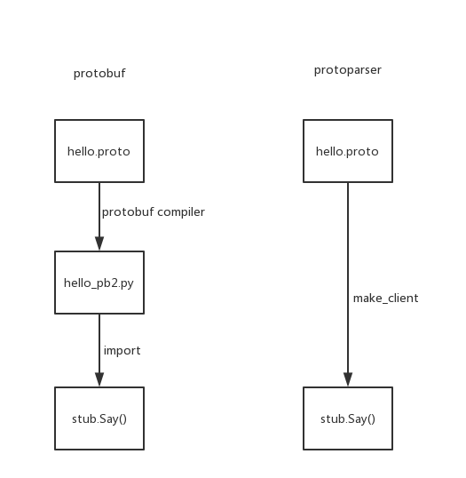

# proto_parser

a python compiler for protobuf

github: [https://github.com/LiuRoy/proto_parser](https://github.com/LiuRoy/proto_parser)

## 安装使用

下载代码进入目录之后执行:

```bash
pyton setup.py install
```

当前支持直接读取proto文件构造客户端,使用方法参考example/client.py

```python
import grpc
from protoparser import make_client

client = make_client('./helloworld.proto')
![Uploading protoparser1_151005.png . . .]

channel = grpc.insecure_channel('localhost:50051')
stub = client.GreeterStub(channel)
response = stub.SayHello(client.HelloRequest(name='abc'))
print("Greeter client received: " + response.name)
```

## 代码讲解

本人接触到的rpc通信协议有thrift和protobuf，两者很类似。虽然原生的thrift和protobuf编译器针对不同语言都只能将接口文件转换为可以使用的中间文件，但不同于其他静态语言，python的动态类型可以很方便的将接口文件直接加载使用，例如thrift的python第三方库thriftpy，使用起来比原生库要方便很多。但个人觉得thriftpy自己造轮子的成分过多，client、servier以及底层的通信实现全部重写了一套，不是很确定能否和原生框架无缝对接。参考thriftpy，自己也实现了一个简单的protobuf编译器，解析生成的结果也尽量用原生对象。

左边是官方提供的protobuf使用流程，具体参考链接[http://www.grpc.io/docs/quickstart/python.html](http://www.grpc.io/docs/quickstart/python.html)，可以看出每次修改完protobuf文件都需要用protobuf compiler重新生成中间文件，使用上不是很友好，期望的目标是右边那样，只需要重启一下进程就可以了。



### 词法分析

详见文件lexer.py，直接使用第三方库ply做的词法解析。词法分析算法上很复杂，但是使用起来却很直观，就是将输入文本按照自定义的规则解析为一个一个的符号。详细内容可以参考[lex文档](http://www.pchou.info/open-source/2014/01/18/52da47204d4cb.html)。

### 语法分析

详见文件grammar.py，也是直接使用的第三方库ply做的语法分析，具体的文法参考的thriftpy，thriftpy的语法解析用到了很多全局变量，虽然实现简单而且好理解，最大的缺陷就是不是线程安全，不能支持多线程，所以具体的实现上做了一些调整。调整内容有一下：

+ 语法上为proto3的子集，protoparser解析没有问题的接口文件原生编译器一定能解析，反之不一定
+ enum packed singular import reserved option oneof等关键词不支持，因为用不上，所以也就懒得实现
+ 不支持在message仲嵌套定义message，但是可以使用已经定义的message类型
+ 因为是在最后做的符号检查，支持用到的符号在后面定义

没有编译基础的童鞋阅读ply的[yacc文档](http://www.pchou.info/open-source/2014/01/18/52da47204d4cb.html)可能比较迷茫，建议看一下编译原理仲关于语法分析相关的概念和算法，在此推荐胡伦均的编译原理，每一个概念都会给很多例子解释，很适合入门学习。至于轮子哥推荐的parsing techniques以及龙虎鲸书，可以作为进阶学习使用。

ply的语法分析使用了LRLR算法，这是一种至下而上的分析法，也就是从给定的输入串开始，根据文法规则逐步进行归约，直至归约到文法开始的符号，或者说从语法树的末端开始，步步向上归约，直至根节点的分析方法。自定义的函数也是在对应的文法归约的时候执行，理解了这一点对使用ply很重要，定义好文法之后，按照文法一步一步实现归约函数，写语法解析也是一件很有意思的事情。

### 类型转换

详见objects.py和parser.py，自己实现的语法解析直接解析为原生的对象，而是按照自己的文法逻辑先解析成objects.py仲定义的类型，然后在parser.py仲做了一些转换，由于没有相关的文档，实在是不清楚原生对象的使用方法，所以盲人摸象般的写了最简单类型的转关规则。本来以为python动态类型用起来很美好，但是真的大量使用的时候，不仅不好调试，而且连自己也看不懂写了啥玩意儿。欢迎有兴趣的同伴提修改建议。